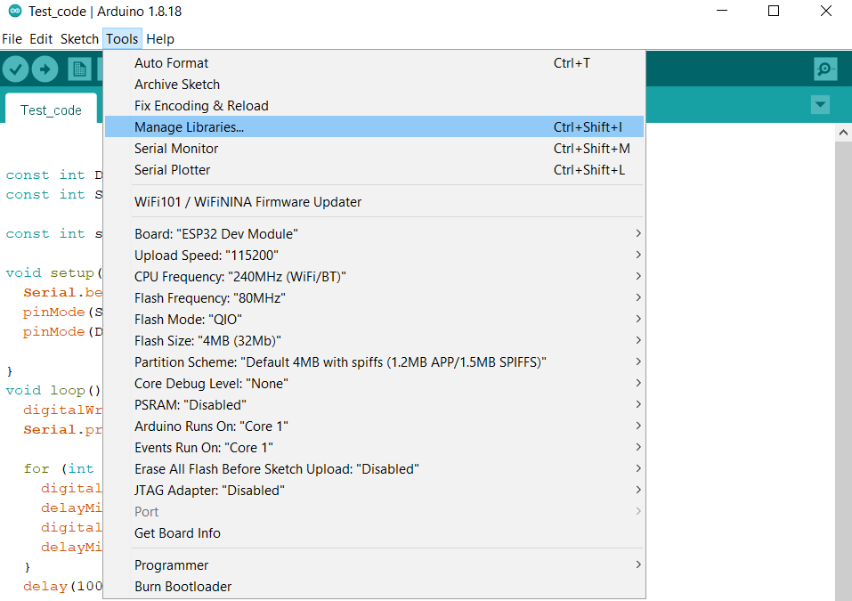

# Project for testing work stepper motor like NEMA 17

## Required Components

**Hardware**

* NEMA 17

* ESP WROOM 32

* DRV8825 

* Laboratory power supply

**Software**

* ArduinoIDE

**Libraries**

* ESP32 in ArduinoIDE

## Project Setup

**Setup Board**

**Connections:**
* Connect ESP to DRV: `G12 - DIR`, `G14 - STEP`, `SLP - RST(this connect DRV to DRV)`, `5V - FAULT`, `GND - GND LOGIC`
   
* Connect NEMA 17 to DRV: `Red - B2`, `Blue - B1`, `Green - A2`, `Yellow - A1`

* Connect Laboratory power supply to DRV: `+ - VMOT`, `- - GNDMOT`

   

## WARNING!

Before connecting the stepper motor with the driver module we have to make sure that the current running through the motor coils does not exceed the maximum rated current of the motor. To do that we will use the current limiting potentiometer featured on the DRV8825 motor driver as seen below:

DRV8825 Driver Module Potentiometer
We will require a multimeter. Connect the positive terminal of the multimeter with the potentiometer and the negative end of the mutimeter with the GND of the driver module. The voltage measured at this point will be known as Vref. Adjust the potentiometer by turning it and the values for Vref will vary.

To set a current limit the following formula is used:

Current Limit = **Vref x 2.5**

Now set the Vref according to your motor’s rated current in order to ensure that the current is within the current limits of the motor